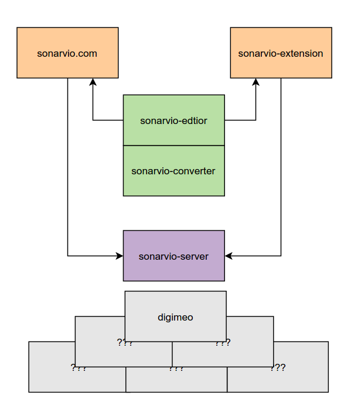

# Structure

To 

initial idea

	1 - getting source data

		different sources:
		- user defined files through uploading
		- external files on 3rd party websites

	2 - apply transforms for comparison

	3 - use a service to look up hashes in a database

	4 - find shops offering the song

From the beginning it was clear that aside of a shared persistent web application, a user specific browser extension would be required for the input. Although the hosted application would allow the upload of manually select existing files to analyse, accessing the data of 3rd a party websites still wouldn't be possible.

Since at the time each of the major browser vendors has their
own extension scheme - the idea was to just write the minimum
of platform specific code and focus on shareable elements.

